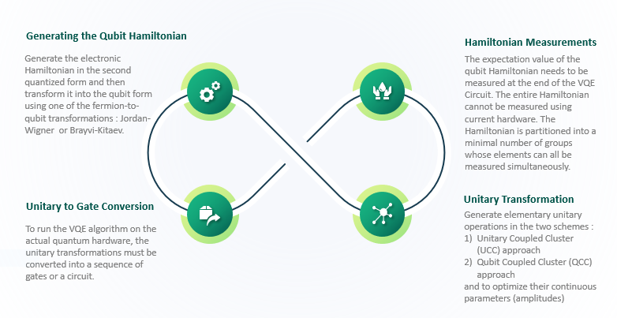

# Quantum Cohort Project Business Application

For each weekly project, your team is asked to complete the below business application exercise.
To complement the technical tasks, please consdier the four questions below.
You are free to format your response to these four questions as you wish (with the final question done as a short recorded video), and to include
the content (or links to the content) on your forked repository.

A brief example for each question is included for the 
[Traveling Salesman Problem.](https://en.wikipedia.org/wiki/Travelling_salesman_problem)

## Step 1: Explain the technical problem you solved in this exercise

We are using Variational Quantum Eigensolver (VQE) for obtaining the potential energy surfaces (PES) for small molecules. Currently, the variational quantum eigensolver (VQE) is the most feasible technique for solving the electronic structure problem on a near term nosiy quantum computer. The following molecules have been simulated using both classical and quantum simulations : H2, LiH, H2O and N2. H2 and LiH are weakly correlated and H2O and N2 are strongly correlated.

The quantum subroutine has two fundamental steps :
1) Prepare the quantum state called anstz
2) Measure the expectation value

The variational principle bound allows us to use classical computation to run an optimization loop to find their eigenvalue :
1) Use a classical, non-linear optimizer to minimize the expectation value by varying ansatz parameters
2) Iterate until convergence

## Step 2: Explain or provide examples of the types of real-world problems this solution can solve

There are a number of real world problems this solution can solve, including water treatment, fertilizer manufacturing and more efficient battery production processes.

Water Treatment : This market is valued at USD 23.80 billion in 2016. It is expected to register a CAGR of 7.1% by 2025. The industry can be classified into residential and non-residential segments. The residential segments account for 115.2 million units. Exponential growth in residential construction across the world is expected to contribute significantly to the growth of this application segment.

Fertlizer Manufacturing : Creating energy efficient processes to manufacture ammonia is a $11 billion problem without a solution. Ammonia is currently produced through the Haber-Bosch process, which utilizes a synthetic reaction with hydrogen and nitrogen gas. This requires extremely high pressure and temperature conditions as well as an expensive metal catalyst. The application of quantum computing capabilities to simulate the dissociation of the triple bond in the nitrogen molecule will help to create a more energy efficient methof of ammonia synthesis.

Efficient Battery production :

References :
https://digitalcommons.dartmouth.edu/cgi/viewcontent.cgi?article=1031&context=dujs

## Step 3: Identify at least one potential customer for this solution - ie: a business who has this problem and would consider paying to have this problem solved

Examples: 
- Federal Express
- Canada Post

## Step 4: Prepare a 90 second video explaining the value proposition of your innovation to this potential customer in non-technical language

Example: By travelling to all destinations via the shortest route, a courier can generate the same revenue that it would have generated following any other route, but will minimize travel costs (e.g., fuel costs). By minimizing travel costs, the courier will be more profitable than it would have been had it travelled through any other route.
