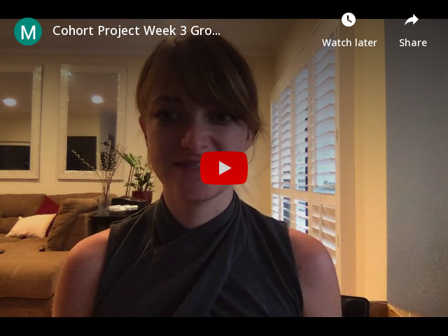

# In Vino Veritas: Wine Authentication

## Explain the technical problem you solved in this exercise
The focus of this project is to study spectroscopy from a quantum viewpoint. The Frank Condon Factor explains the intensity of vibronic transitions. Vibronic transitions are the changes in the electronic and vibrational energy of molecules when interacting with electromagnetic radiation. Spectroscopy is the study of matter and its interaction with electromagnetic radiation. Through spectroscopy and Frank Condon Factors, we can study and understand the properties of molecules. A comparison of the spectroscopic data from a sample can tell us about its temperature and chemical composition. The spectroscopic data is a fingerprint! It can be compared to other well-known sample templates to pin-down the origin and location of the sample.

To tackle the technical challenge, we studied different theoretical methods to investigate and predict chemical properties of molecules. In particular we are focusing on the so called vibronic transitions and Franck-Condon factors of molecules. First, we started by analyzing hydrogen as a proof of concept, demonstrating that our theoretical calculations line up well with experimental data. We then leveraged several sophisticated tools to expand the analysis to a variety of molecules both large and small including the Vanadium molecule. 

## Explain or provide examples of the types of real-world problems this solution can solve

#### Astronomical Studies:
  >Astronomers leverage astronomical spectroscopy in the study of chemical compositions belonging to distant stars. The absorption lines of the sun and the emission spectra of different gases help identify the chemical constituents of the stars.
  
#### Food and Beverage:
  >The food industry currently leverages spectroscopy in the analyses required to improve the quality control of foods and beverages. Vendors can determine the falsification, adulterations, identification of origin, the origin and variety of food, beverages, and especially wine. 
  
#### Forensic Applications
  >Forensic Scientists will use spectroscopy for :
  
>Toxicology Analysis:
	Forensic analysts can identify the presence of toxic substances and their concentrations found in tissue samples and bodily fluids. Investigators can gain valuable information about the time and dosage of any poison. 
  
>Trace Evidence:
	Investigators can analyze trace elements such as fibers, glass fragments, or paint flakes. Spectroscopy can determine the exact combination of dyes used in carpet fibers and constituent components of any material analyzed. 
  
>Arson Investigations:
	investigators can analyze any residue found at a crime scene and generate accurate reports on the molecular makeup of the substance.

## Identify at least one potential customer for this solution - ie: a business who has this problem and would consider paying to have this problem solved
The global wine market in 2018 had a valuation of 354.7 billion U.S dollars. The projected market growth is 21% by 2023 to a value of 429 billion U.S dollars.  However, the market is currently facing a wave of counterfeit products. Counter fitters are flooding the market with sub-par products, which not only takes profit away from the vineyards but also poses a threat to brand reputability. Estimates place at least 20% of the world wine supply as fake. Liv-ex a worldwide secondary market for wine with a believed approximate value of $5 billion. If as much as 20% of their wine is fake, then the counterfeit trade for their product is currently worth $1 billion. This year, with the global pandemic severely limiting wine collectors' and consumers' ability to buy wine in person directly from the source, this percentage is only expected to grow. With such large sums of money lost to fraud and the growing consumer anxiety, the wine industry is in desperate need of a solution that can verify the authenticity of their products.

The problem is that today, nearly all the anti-fraud techniques currently available are cosmetic, meaning they simply involve analyzing the visual appearance of the wine, bottle, and label. These methods are notoriously unreliable, especially when a large portion of wine counterfeiters deal in refilling authentic bottles. When it comes to analyzing the chemical composition of wine, the importance of the nearly trace amounts of compounds present vastly outweighs the major components of wine which is made up mostly of water and ethanol. So in order to accurately assesss a wine's authenticity, there needs to be a highly-sensitive and accessible solution for wine experts, investigators, collectors, and producers and this is what we would aim to accomplish. 

In our research, there are two main concerns around counterfeit wine for which we hypothesize wine industry stakeholders would pay to have a reliable solution. 
1) Collectors and restaurants pay handsomely for expensive bottles, and want to ensure beyond reasonable doubt that what they are purchasing is the real thing. 
2) An even more lucrative problem to solve is that of reputation protection. In the wine industry, it is very important that producers maintain the prestige of their brand, and a scandal involving counterfeit wine can cost them much more than just the lost revenue.

## Software Licensing

[Software Licensing.](./Challenge4.md)

## Step 4: Prepare a 90 second video explaining the value proposition of your innovation to this potential customer in non-technical language

## References
http://www.thedrinksbusiness.com/2013/11/fake-wine-now-accounts-for-20-of-market/
https://www.thedrinksbusiness.com/2016/12/how-much-fake-fine-wine-is-in-the-market/
https://www.thedrinksbusiness.com/2016/12/550m-worth-of-kurniawan-counterfeit-wines-being-resold-over-and-over-again/
https://www.townandcountrymag.com/society/money-and-power/a23065645/wine-fraud-scandals/
https://www.thestar.com/business/2017/01/21/counterfeit-wine-market-a-growing-concern.html
https://www.theguardian.com/global/2016/sep/11/the-great-wine-fraud-a-vintage-swindle

