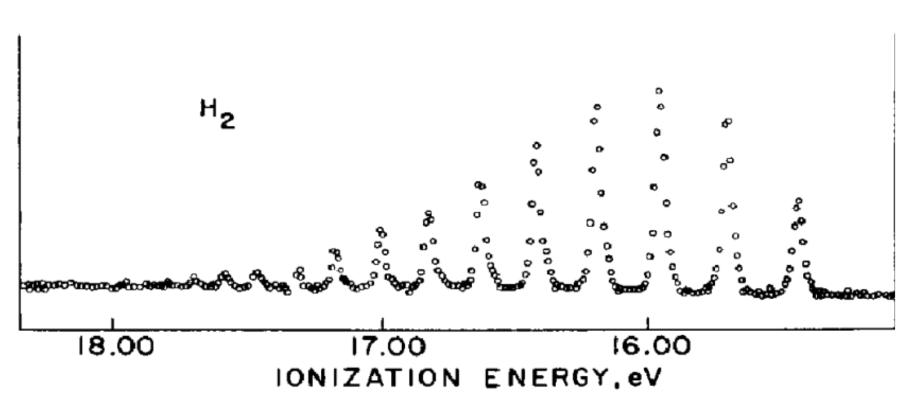

## Project 3: Franck-Condon Factors

In this project we calculate Franck-Condon Factors, which is related to the intensities in spectra of vibrational transitions across electronic surfaces. Spectra can be measured through experiments, but having accurate theoretical calculations of these Franck-Condon Factors allow scientists to instead predict these experimental results. This is especially useful if the chemical species is expensive, difficult to acquire or difficult to study or if the experiment itself is expensive or difficult.

A very brief introduction to the main ideas behind the project are
[here.](https://github.com/CDL-Quantum/CohortProject_2020/blob/master/CDL_2020_docs.pdf)

In our [Project3_LandingPage.pdf](https://github.com/CDL-Quantum/CohortProject_2020/blob/master/Project_3_Franck_Condon_Factors/Project3_LandingPage.pdf), we provide more technical information about the chemistry and physics behind these Franck-Condon Factors.

# Tasks
We calculate the Franck-Condon Factors (and spectra) of **molecular Hydrogen**, of more complex **molecule V3** and for the latter the same calculations using **vibronic sampling** using Gaussia Boson Sampler, a photonic special-purpose device by Xanadu programmed by their Strawberryfields software ramework.  
The calculations for first task for the Hydrogen molecule can be found in [Task1 jupyter notebook](https://github.com/hay-k/CohortProject_2020_w3g7/blob/master/Project_3_Franck_Condon_Factors/Task1.ipynb). Particularly, we calculate transitions from n=0 state of $H_2$ to 10 other vibronic levels for $H_2^+$. The figures below show
  

## Further Challenges:
* An alternative and analogous method to calculating these Franck-Condon Factors using matrix elements is to use a loop hafnian approach. This loop hafnian approach uses GBS which would allow these factors to be calculated using a quantum circuit. Use the result of Task 3 to provide data to a skeleton code provided that uses loop hafnians to calculate the Franck-Condon Factors.
* Explain briefly the similarities and differences between these three methods.
* What are advantages and disadvantages of codes licensed for the public domain and those that are licensed for private use

## Business Application
One again, your team is asked to complete a Business Application. Questions you will be asked are:

* Explain to a layperson the technical problem you solved in this exercise.
* Explain or provide examples of the types of real-world problems this solution can solve.
* Identify at least one potential customer for this solution - ie: a business who has this problem and would consider paying to have this problem solved.
* Prepare a 90 second video explaining the value proposition of your innovation to this potential customer in non-technical language.

For more details refer to the [Business Application found here](./Business_Application.md)

## Presenting your results in your pull request
For your pull request, consider the following for the presentation of your final results:
- Work entirely in the directory for Project 3.
- Edit this README.md file with a highlight of your main technical results.  Provide links to any other files with your detailed results, e.g. Jupyter notebooks.
- For your Business Application, feel free to provide your answers directly in the 
[Business_Application.md](./Business_Application.md) file.
- Do not directly upload your video file (or any other large files) to the repository.  Instead, provide a link e.g. to a YouTube video, or a Google Drive file.
- Include a file contributions.md that lists the contributions of each group member.
